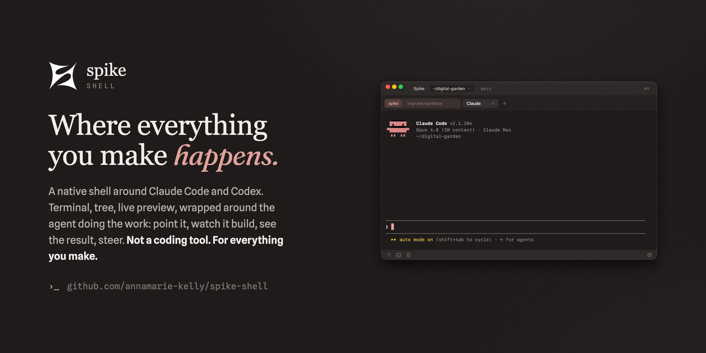

<p align="center">
  <a href="https://github.com/annamarie-kelly/spike-shell">
    
  </a>
</p>

# Spike Shell

A native macOS shell around [Claude Code](https://www.anthropic.com/claude-code) and [OpenAI Codex](https://github.com/openai/codex).

The agent already does the work: research, skills, file generation, tool use. What it lacks is a frame. Spike gives it one. A file tree, real terminals, a preview that doubles as an editor, and panes you can drag anywhere. The terminal is still the chat. Spike just makes it a place you want to live. Bring your own agent, Claude Code or Codex; Spike auto-detects both.


## What it does

- **Multiple named terminals.** Each tab is its own agent session, Claude Code or Codex, with a real PTY underneath. Add with `+` (pick the engine per tab from the launcher), rename anytime (double-click or right-click), close with `×`.
- **A chat view over any session.** ⌘⇧E (or right-click the tab) flips a lane from terminal to conversation: your messages, the agent's prose, and every tool call folded into one plain-language line you can expand. It's a formatting layer, not a second client — it renders the transcript the agent CLI already writes, sends by typing into the same PTY, and works with Claude Code or Codex. The terminal is alive underneath the whole time, one click away, and the view says so when the agent is waiting on an answer only the terminal can take.
- **Chrome-style tab groups.** Group sessions, name them, give each a color, collapse and expand. Groups are durable workspaces: each carries its own context prompt, injected into every session that spawns inside it.
- **Drag-to-dock tiling.** Grab a pane by its header and drop it on another pane's edge to split, or its center to stack. Drag a terminal tab off the strip to give that session its own pane. Drag a file from the tree onto an edge and the preview opens right there. The sidebar pins left or right. The layout persists.
- **A preview that edits.** Markdown (rendered, wikilinks clickable), HTML, CSV, JSON, images, PDF, media — plus a syntax-highlighted editor with ⌘S save.
- **Drop a screenshot into the chat.** Drag an image onto a terminal — even the floating thumbnail right after ⌘⇧4 — and it lands in the prompt as the agent's own image attachment. Other files drop their path, same as dragging from the tree.
- **Open any folder.** Pick a folder with the native dialog; the tree re-roots and new terminals spawn there. Spike is not tied to any one project.
- **One calm surface.** A warm theme that follows the terminal, not a corporate dashboard.

## Install

Download the latest signed build: **[Spike for Mac (Apple Silicon)](../../releases/latest)**. It's a notarized `.dmg`, so no developer tools are needed. Open it, drag Spike into Applications, launch. You'll still need [Claude Code](https://www.anthropic.com/claude-code) (`claude`) or [OpenAI Codex](https://github.com/openai/codex) (`codex`) on your PATH; Spike is a frame around the agent, not a replacement. It auto-detects both, and you pick the default in Settings or per tab from the `+` launcher.

Intel Macs and Windows/Linux aren't built yet.

## Build from source

For development, or to build it yourself. Spike is a [Tauri](https://tauri.app) app. Requires Node 18+, the [Rust toolchain](https://rustup.rs), and an agent on your PATH: [Claude Code](https://www.anthropic.com/claude-code) (`claude`) or [OpenAI Codex](https://github.com/openai/codex) (`codex`).

```bash
git clone https://github.com/annamarie-kelly/spike-shell.git
cd spike-shell
npm install
npm run dev:tauri      # build + launch the app
```

To install it as a real app (builds a release bundle and copies it to `/Applications`):

```bash
npm run install:app
```

### Configuration

Settings live in the app (gear icon, ⌘,): theme, spawn defaults, the action log, and group workspaces. Two optional environment variables for development:

| Variable         | Default       | What it does                                          |
| ---------------- | ------------- | ----------------------------------------------------- |
| `SPIKE_CMD`      | `claude`      | What each terminal runs (`codex` or `zsh` also work; overridden by the engine choice in Settings) |
| `SPIKE_REPO_DIR` | auto-detected | Where to find `bin/` + `shims/` (set for odd setups)  |

## How it works

Spike is deliberately small. The backend is Rust (`src-tauri/`): a real PTY per terminal via [`portable-pty`](https://crates.io/crates/portable-pty), filesystem ops, a file watcher, and a tiny localhost listener on `:7878` for the CLI bridge. The frontend (`src/web/app.ts`) drives [xterm.js](https://xtermjs.org) for the terminals and plain DOM for everything else — no UI framework. All transport goes through one shim (`src/web/ipc.ts`), the only file that knows Tauri exists.

The chat view (`src/web/chatview.ts`) is deliberately thin. It renders from the JSONL transcript each agent CLI already writes — tailed incrementally by byte offset (`transcript_tail`), one small adapter per engine — rather than trying to reconstruct meaning from a redrawing TUI's escape codes. Sending is `ptyWrite` into the same session, so every feature the CLI grows still works and nothing here depends on a vendor SDK. `node scripts/chat-demo.mjs [transcript.jsonl]` renders any transcript through the same code into a standalone page.

[esbuild](https://esbuild.github.io) bundles the frontend in milliseconds (`npm run build:web` → `dist-web/`). Type-checking is a separate, advisory gate (`npm run typecheck`); esbuild builds even while types are still being tightened. The layout engine is a plain recursive split tree (`src/web/layout.ts`, unit-tested) whose renderer re-parents live DOM nodes, so xterm scrollback and editor state survive any drag.

Two small commands on the embedded terminal's PATH (`bin/spike`) bridge the agent and the UI. `spike open <target>` opens a file into the preview (or re-roots the tree) instead of summarizing it; an http(s) URL or a bare `host:port` like `localhost:3457` opens live in the preview panel's browser instead of telling you to go find a browser window. `spike context` reports back what you're currently looking at — the open file, the tree selection, the project root, recently opened files — so the agent can resolve "this file" or "what I'm looking at" to a real path without asking. The page reports its focus to the server on every change (`POST /focus`); `spike context` reads it back (`GET /context`). Push and pull, mirror halves. References only, never contents: the agent reads the file itself if it needs the bytes.

Spike also keeps an **append-only action log** at `~/.spike/logs/<day>.jsonl` — one JSON event per line, server-stamped: `tab_spawn`, `file_open`, `group_assign`, `file_save`, `spike_open`, and so on. It also records `file_change` for edits that happen *outside* Spike's own UI — the agent's edits from inside the terminal, or an external command — by promoting what the project's file watcher already sees (Spike's own writes are suppressed so they don't double-log). Spike only records; it does no analysis. The point is that you can ask your own questions of it — open a session and say "read my spike log and tell me how to tighten my workflow," write a retro, or audit your own habits. The intelligence layer is your agent plus your curiosity, not a suggestion engine baked into the tool.

## Status

Early but lived-in: it's the daily driver it was built to be. Terminals, groups, the tiling layout, the preview/editor, settings, and the agent bridge all work today. macOS only for now (the PTY and titlebar work is portable in principle; nobody has run it elsewhere yet).

## A personal instrument, not a product

Spike is built for how I work. I ship it because I like it, not because I'm running a project. Issues and PRs are welcome but unpromised, and the direction stays mine.

The code is MIT: fork it, change it, ship it. Two asks if you do: give your fork its own name, and sign it with your own Apple Developer ID. The official, notarized "Spike" builds come from me. A marketplace for templates, plugins, and themes is the part I'm building as a product on top.

## License

MIT

